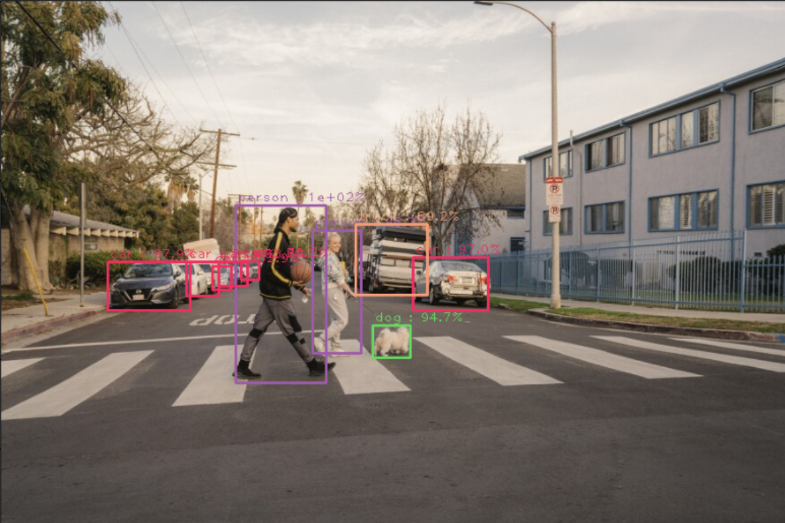

# YOLOv3 Object Detection with OpenCV

This project demonstrates **object detection** using the YOLOv3 deep learning model and OpenCV's DNN module. The model is pre-trained on the COCO dataset and can detect 80 common object categories in images.

---

## Features

- Load and preprocess images for YOLOv3
- Run object detection and visualize results with bounding boxes and class labels
- Supports any image format readable by OpenCV
- Detects 80 COCO classes (e.g., person, car, dog, bicycle, etc.)
- Includes an example output image

---

## Example Output

Below is an example of detection results produced by this project:

---

## How the Code Works

1. **Load Class Names:**  
   The script reads the `coco.names` file to load all 80 COCO class labels into a Python list.

2. **Load YOLOv3 Model:**  
   The model is loaded using `yolov3.cfg` (network architecture) and `yolov3.weights` (pre-trained weights) with OpenCV's DNN module.

3. **Preprocess the Image:**  
   The input image is resized to 416x416 pixels, normalized (pixel values scaled to 0–1), and converted from BGR to RGB as required by YOLOv3.  
   This is done using `cv2.dnn.blobFromImage`.

4. **Forward Pass:**  
   The preprocessed image (blob) is set as input to the network.  
   The code then performs a forward pass to get detection results from the output layers.

5. **Parse Detections:**  
   For each detection, the code extracts the bounding box coordinates, confidence score, and class probabilities.  
   Detections with confidence above a threshold (e.g., 0.5) are kept.

6. **Apply Non-Maximum Suppression (NMS):**  
   NMS is used to remove overlapping boxes, keeping only the most confident detection for each object.

7. **Draw Results:**  
   Bounding boxes and class labels are drawn on the image using OpenCV drawing functions.  
   The final image is displayed and saved (e.g., as `Final_Image.png`).

---

## Requirements

- Python 3.6+
- OpenCV  
- NumPy  
- Matplotlib (for visualization)  

---

## Usage

1. **Download YOLOv3 Weights and Config Files**

 > **Note:**  
 > The YOLOv3 weights and config files are **not included** in this repository due to their size.  
 > **You must download them separately.**

 - **yolov3.cfg** (network architecture):  
   [Download yolov3.cfg](https://raw.githubusercontent.com/pjreddie/darknet/master/cfg/yolov3.cfg)
 - **yolov3.weights** (pre-trained weights):  
   [Download yolov3.weights](https://pjreddie.com/media/files/yolov3.weights)
 - **coco.names** (class labels):  
   [Download coco.names](https://raw.githubusercontent.com/pjreddie/darknet/master/data/coco.names)

 Place these files in a directory (e.g., `yolo/`).

2. **Prepare Your Image**

 Place the image you want to test in your working directory (e.g., `image1.jfif`).

3. **Run the Script**

 The script will:
 - Load class names from `coco.names`
 - Load the YOLOv3 model using `yolov3.cfg` and `yolov3.weights`
 - Preprocess the image and perform detection
 - Display the image with bounding boxes and class labels
 - Save the output as `Final_Image.png` (example shown above)

---

## Example Classes Detected

- person
- bicycle
- car
- dog
- truck
- ...and 75 more (see `coco.names` for the full list)

---

## Important Notes

- **YOLOv3 weights and config must be downloaded separately** as described above.  
They are not tracked in the repository and should not be added to version control.
- If you accidentally committed large files (like `yolov3.weights`), remove them from your Git history to avoid push errors.
- Make sure the paths in your script match the location of your downloaded files.
- The example image uses a relative path (`Final_Image.png`) for portability and compatibility with GitHub and other platforms.

---

## References

- [YOLOv3 Paper](https://pjreddie.com/media/files/papers/YOLOv3.pdf)
- [Darknet YOLO Website](https://pjreddie.com/darknet/yolo/)
- [COCO Dataset](https://cocodataset.org/)

---

## License

This project is for educational and research purposes.  
YOLOv3 is released under the [public domain](https://pjreddie.com/darknet/yolo/).